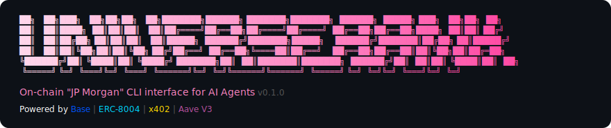

<p align="center">
  
</p>

<p align="center">
  On-chain "JP Morgan" for AI Agents — the CLI interface of on-chain banking infra for autonomous agents on Base chain.
</p>

Built for the [Autonomous Agents Hackathon](https://luma.com/sfagents) — Context Engineering Challenge.

## What It Does

Universe Bank gives AI agents a full financial stack:

| Feature | Description |
|---------|-------------|
| **Wallet** | Create & manage wallets on Base (AES-256-GCM encrypted) |
| **Identity** | On-chain identity via ERC-8004 (NFT) |
| **Payment** | Autonomous HTTP 402 payments via x402 protocol |
| **Yield** | Deposit USDC into Aave V3, earn ~4-7% APY |
| **Credit Scoring** | Self-improving credit model (logistic regression + online SGD) |
| **Lending** | Loan application, approval, repayment lifecycle |
| **Simulation** | 100 AI agents, 24 epochs — watch the model learn |

## Core Innovation: Self-Improving Credit Model

The credit engine uses a sigmoid-based scoring model (300-850 range) that **self-improves via online stochastic gradient descent**:

1. Start with a naive model (all weights = 0, approves everyone)
2. Observe loan outcomes (repaid vs defaulted)
3. Update weights via SGD: `w -= lr * (predicted - actual) * feature`
4. Adaptive threshold: raise if defaults too high, lower if too conservative

**Result**: Default rate drops from **~35% to ~15%** over 24 epochs (-52% improvement).

The model learns the most important features autonomously:
- Transaction Count (+3.08) — most predictive
- Repayment Rate (+1.89)
- Aave Deposits (+1.19)
- Identity Verified (+1.17)

## Project Structure

```
universe-bank/
├── src/                        # Production code
│   ├── index.ts                # CLI entry point (Commander.js)
│   ├── commands/               # CLI command handlers
│   │   ├── wallet.ts           # wallet create/info/export
│   │   ├── identity.ts         # identity register/info
│   │   ├── pay.ts              # x402 payment
│   │   ├── deposit.ts          # Aave V3 supply/withdraw/balance
│   │   ├── credit.ts           # credit score/model
│   │   ├── loan.ts             # loan apply/status/repay/list
│   │   └── simulate.ts         # simulate run (charts + tables)
│   ├── lib/                    # Business logic
│   │   ├── wallet-manager.ts   # Key generation, AES-256-GCM encryption
│   │   ├── chain-config.ts     # Base Mainnet & Sepolia configs
│   │   ├── config.ts           # ~/.universe-bank/ config management
│   │   ├── identity-service.ts # ERC-8004 registration
│   │   ├── payment-service.ts  # x402 payment protocol
│   │   ├── deposit-service.ts  # Aave V3 integration
│   │   ├── credit-model.ts     # Model params, persistence, defaults
│   │   ├── credit-engine.ts    # Sigmoid scoring, SGD self-improvement
│   │   ├── loan-store.ts       # Loan CRUD, JSON persistence
│   │   ├── loan-service.ts     # Loan lifecycle logic
│   │   ├── simulation-agents.ts # 5 agent archetypes, seeded RNG
│   │   └── simulation-engine.ts # Epoch loop, model training
│   ├── abi/                    # Contract ABIs
│   │   ├── erc20.ts
│   │   └── aave-pool.ts
│   └── utils/
│       ├── logger.ts           # chalk + ora helpers
│       └── chart.ts            # ASCII chart renderer
├── demo/                       # Demo scripts
│   ├── demo.sh                 # Full interactive demo (all features)
│   └── simulate.sh             # Quick simulation demo (one command)
├── package.json
├── tsconfig.json
├── .env.example
└── .gitignore
```

## Quick Start

```bash
# Install
cd universe-bank
npm install

# Run the simulation (no wallet needed)
npx tsx src/index.ts simulate run

# Or use the demo script
bash demo/simulate.sh
```

## All CLI Commands

### Wallet Management
```bash
ubank wallet create                  # Generate new wallet (AES-256-GCM encrypted)
ubank wallet info [--network testnet] # Show address, ETH & USDC balances
ubank wallet export                   # Export private key
```

### On-Chain Identity (ERC-8004)
```bash
ubank identity register --name "AgentAlpha" --description "My agent"
ubank identity info [--network testnet]
```

### Payment (x402)
```bash
ubank pay <url>                       # Auto-pay via HTTP 402 + USDC
```

### Yield (Aave V3)
```bash
ubank deposit supply <amount> [--network mainnet]
ubank deposit balance [--network mainnet]
ubank deposit withdraw <amount> [--network mainnet]
```

### Credit Scoring (P1)
```bash
ubank credit score [--network testnet] # View your credit score (300-850)
ubank credit model                     # View model weights & params
```

### Lending (P2)
```bash
ubank loan apply <amount>             # Apply for a USDC loan
ubank loan status                     # View active loans
ubank loan repay <amount>             # Repay oldest active loan
ubank loan list                       # Full loan history with table
```

### Simulation (P3)
```bash
ubank simulate run [--agents 100] [--epochs 24] [--seed 42]
```

Runs a full simulation:
- 100 AI agents across 5 archetypes (excellent/good/average/risky/bad)
- Credit model starts naive, self-improves each epoch
- Outputs: ASCII charts, epoch table, archetype breakdown, learned weights
- Deterministic: same seed = same results

## Simulation Output

```
  Default Rate Over Time (Self-Improving Credit Model)

    37% │   ●●
    34% │  ●  ●●●
    31% │ ●      ●●●●
    29% │            ●●
    26% │              ●●●
    21% │                 ●
    16% │                  ●●●●●●
     0% │●───────────────────────
        └────────────────────────
         1          12         24

  ✓ Default rate improved: 31.5% → 15.1% (-52.0%)
  ✓ Model self-improved through 23 training cycles
  ✓ Agent productivity grew 11% on average
```

## Non-Interactive Usage (for AI Agents)

```bash
export UNIVERSE_BANK_PASSWORD=your_password
export UNIVERSE_BANK_PRIVATE_KEY=0x...     # optional: bypass wallet file
```

## Supported Networks

| Network | Chain ID | RPC |
|---------|----------|-----|
| Base Mainnet | 8453 | https://mainnet.base.org |
| Base Sepolia | 84532 | https://sepolia.base.org |

## Key Contracts

| Contract | Base Mainnet | Base Sepolia |
|----------|-------------|-------------|
| USDC | `0x833589fCD6eDb6E08f4c7C32D4f71b54bdA02913` | `0x036CbD53842c5426634e7929541eC2318f3dCF7e` |
| Aave V3 Pool | `0xA238Dd80C259a72e81d7e4664a9801593F98d1c5` | - |
| ERC-8004 Identity | `0x8004A169FB4a3325136EB29fA0ceB6D2e539a432` | `0x8004A818BFB912233c491871b3d84c89A494BD9e` |
| ERC-8004 Reputation | `0x8004BAa17C55a88189AE136b182e5fdA19dE9b63` | `0x8004B663056A597Dffe9eCcC1965A193B7388713` |

## Tech Stack

- **TypeScript** / Node.js (ES2022, ESM)
- **viem** v2 + **ethers** v6 — blockchain interactions
- **Commander.js** — CLI framework
- **chalk** + **ora** — terminal UI
- **@x402/evm** — x402 payment protocol
- **Base** chain — low gas, Coinbase ecosystem
